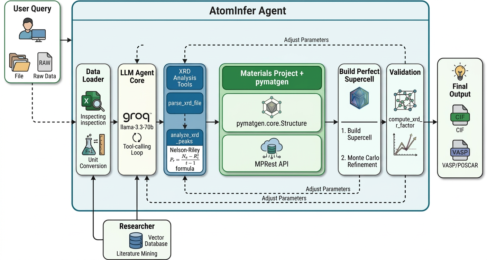

# AtomInfer




AtomInfer is an interactive GUI web application for predicting and inspecting atomistic material structures from experimental data (for example, XRD). It combines an agent-driven pipeline (parsing experimental inputs, querying Materials Project, and building/refining atomistic models) and produces structural models that can be used for simulations and refinement.

This repository contains the frontend single-file UI and a FastAPI backend that proxies Materials Project requests and runs analysis/refinement jobs.

## Features
- Web-based single-page UI served by FastAPI
- Live Materials Project search and full-structure fetch (proxying MP API to avoid CORS)
- Interactive 3D crystal viewer (Three.js) with:
  - CPK coloring, unit-cell wireframe, atom spheres
  - Controls: fullscreen, toggle bonds, reset view, screenshot, export JSON
  - Bottom-center element legend and bottom-left XYZ orientation widget
- Agent pipeline for parsing XRD, Raman Spectra, PDE data from experiments. 
   Estimating lattice/phase, building doped supercells and validating with simulated XRD (R-factor)
- HRMC refinement job support (server-side) with streaming frames via WebSocket

## Repo layout
- `atomInfer_ui.html` — frontend UI (HTML/CSS/JS single file)
- `backend_server.py` — FastAPI backend, endpoints and HRMC job orchestration
- `atomInfer_v2.py` — analysis tools and Materials Project helper functions
- `.env` (optional) — environment variables (not committed) contains Agent API

## Prerequisites
- Python 3.9+
- Recommended packages (install into a venv):

```bash
pip install fastapi uvicorn python-multipart requests pymatgen numpy
```

Some optional features depend on additional native/third-party libs used by HRMC or MEAM code; see `backend_server.py` comments for details.

## Environment
Set API keys before running the server (in shell or a `.env` file in the project root):

```bash
export MP_API_KEY=your_materials_project_api_key
export GROQ_API_KEY=...
```

The repository already supports loading a `.env` file at startup.

## Run the app (development)

```bash
# from repo root
uvicorn backend_server:app --reload --host 0.0.0.0 --port 8000
```

Open the UI at `http://localhost:8000/` (or remote host + port if exposing).

## Important API endpoints
- `GET /` — serves the `atomInfer_ui.html` UI
- `POST /api/mp_search` — proxy search to Materials Project (body: `{ "formula": "LiMn2O4" }`)
- `GET /api/mp_structure/{mp_id}` — returns structure JSON for viewer (lattice + sites)
- `POST /api/runs` — start an AtomInfer run (job) (returns `run_id`)
- `GET /health` — simple health check with keys presence

HRMC / refinement endpoints:
- `GET /api/cif_structure` — load a local CIF and return viewer JSON
- `POST /api/hrmc/start` — start HRMC refinement (streamed frames)
- `WebSocket /api/runs/{run_id}/stream` — stream job events for a run
- `WebSocket /api/hrmc/{run_id}/stream` — stream HRMC frames

Refer to `backend_server.py` for exact message shapes for streaming events (status, step, event, frame, done, error).

## Frontend viewer notes
- Three.js r128 is loaded from CDN in `atomInfer_ui.html`. The viewer supports orbit controls and responsive resizing.
- Overlay controls (top-right) and legend/axis widgets are injected into the `#structViewport` and shown when a structure is loaded.
- Clicking an MP search result calls `loadStructure(mpId)` which fetches `/api/mp_structure/{mpId}` and renders in the viewer.

## Development notes
- The backend will read a `.env` file in the repo root if present; this is useful for storing `MP_API_KEY` during local development.
- To debug the frontend while developing, open developer tools and watch network requests to the `/api/*` endpoints.
- If you add or change the Three.js viewer code, keep the overlay widgets (controls, axis canvas, legend) as siblings of the WebGL canvas so they are not removed by canvas recreation.

## Contributing
Contributions, bug reports and feature requests are welcome. Open issues or submit PRs.

## License
Add a license as appropriate for your project.
