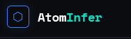
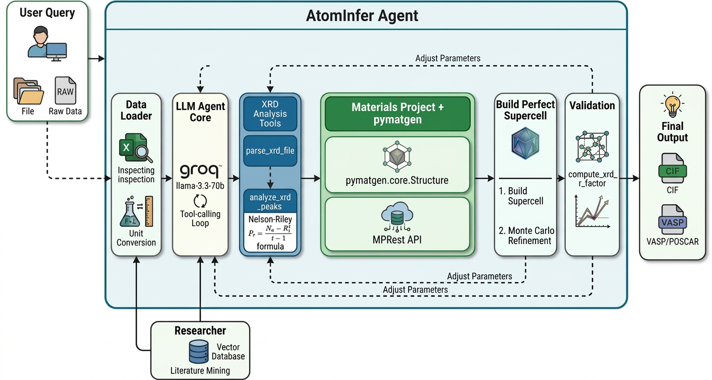

# AtomInfer





AtomInfer is an interactive GUI web application for predicting and inspecting atomistic material structures from experimental data (for example, XRD). It combines an agent-driven pipeline (parsing experimental inputs, querying Materials Project, and building/refining atomistic models) and produces structural models that can be used for simulations and refinement.

This repository contains the frontend single-file UI and a FastAPI backend that proxies Materials Project requests and runs analysis/refinement jobs.

## Features
- Web-based single-page UI served by FastAPI
- Live Materials Project search and full-structure fetch (proxying MP API to avoid CORS)
- Interactive 3D crystal viewer (Three.js) with:
  - CPK coloring, unit-cell wireframe, atom spheres
  - Controls: fullscreen, toggle bonds, reset view, screenshot, export JSON
  - Bottom-center element legend and bottom-left XYZ orientation widget
- Agent pipeline for parsing XRD, Raman Spectra, PDE data from experiments. 
   Estimating lattice/phase, building doped supercells and validating with simulated XRD (R-factor)
- HRMC refinement job support (server-side) with streaming frames via WebSocket

## Repo layout
- `atomInfer_ui.html` — frontend UI (HTML/CSS/JS single file)
- `backend_server.py` — FastAPI backend, endpoints and HRMC job orchestration
- `atomInfer_v2.py` — analysis tools and Materials Project helper functions
- `config.default.toml` — default configuration template (copy to `config.toml`)
- `config_loader.py` — TOML config loader and typed accessors
- `model_registry.py` — multi-provider LLM management with task-based selection
- `materials/` — material profile system (base class, registry)
- `potentials/` — interatomic potential files (MEAM, Buckingham)
- `.env` (optional) — environment variables fallback

## Prerequisites
- Python 3.9+ (Python 3.11+ recommended for built-in `tomllib`)
- Recommended packages (install into a venv):

```bash
pip install fastapi uvicorn python-multipart requests pymatgen numpy openai anthropic
```

Some optional features depend on additional native/third-party libs used by HRMC or MEAM code; see `backend_server.py` comments for details.

## Configuration

AtomInfer uses a TOML configuration file to manage all settings — no hardcoded values.

### 1. Create your config file

```bash
cp config.default.toml config.toml
```

Edit `config.toml` to set your API keys, LLM preferences, and material parameters. The file is gitignored so your keys stay local.

### 2. API keys

Set keys in `config.toml` under `[api_keys]`:

```toml
[api_keys]
mp   = "your_materials_project_api_key"
groq = "your_groq_api_key"
# openai   = ""
# anthropic = ""
```

Or use environment variables (`MP_API_KEY`, `GROQ_API_KEY`, etc.) — config.toml takes precedence.

### 3. LLM model setup

AtomInfer supports multiple LLM providers with task-based model selection:

| Provider   | Setup                                             |
|------------|---------------------------------------------------|
| **Ollama** (local) | `ollama pull llama3.3` — no API key needed |
| **Groq**   | Get key from [console.groq.com](https://console.groq.com) |
| **OpenAI** | Set `openai` key in config                        |
| **Anthropic** | Set `anthropic` key in config                  |
| **vLLM / LM Studio** | Point `base_url` to your local server  |

Configure models and task assignments in `config.toml`:

```toml
[llm]
default_provider = "ollama"          # or "groq", "openai", etc.
default_model    = "llama3.3"
temperature      = 0.05
max_tokens       = 16384

[llm.task_assignments]
xrd_analysis       = ["local-llama"]
raman_analysis      = ["local-llama"]
structure_building  = ["groq-llama"]
general_reasoning   = ["local-llama", "groq-llama"]
```

### 4. Material profiles

Define material systems in `config.toml` under `[materials.*]`:

```toml
[materials.LiMn2O4]
formula            = "LiMn2O4"
mp_id              = "mp-19017"
space_group        = "Fd-3m"
crystal_system     = "cubic"
reference_lattice_A = 8.2480
```

Set the active material: `active_material = "LiMn2O4"`.

## Run the app

```bash
python backend_server.py
```

The server starts on port 8000 and automatically opens the UI in your browser.

**Alternative** (no auto-browser):
```bash
uvicorn backend_server:app --reload --host 0.0.0.0 --port 8000
```

Server settings (port, host, auto-open) are configurable in `config.toml` under `[server]`.

## Important API endpoints
- `GET /` — serves the `atomInfer_ui.html` UI
- `GET /health` — health check with config summary and model availability
- `GET /api/config` — returns current configuration and detected LLM models
- `GET /api/materials/list` — lists configured material profiles
- `POST /api/mp_search` — proxy search to Materials Project (body: `{ "formula": "LiMn2O4" }`)
- `GET /api/mp_structure/{mp_id}` — returns structure JSON for viewer (lattice + sites)
- `POST /api/runs` — start an AtomInfer run (job) (returns `run_id`)

HRMC / refinement endpoints:
- `GET /api/cif_structure` — load a local CIF and return viewer JSON
- `POST /api/hrmc/start` — start HRMC refinement (streamed frames)
- `WebSocket /api/runs/{run_id}/stream` — stream job events for a run
- `WebSocket /api/hrmc/{run_id}/stream` — stream HRMC frames

Refer to `backend_server.py` for exact message shapes for streaming events (status, step, event, frame, done, error).

## Frontend viewer notes
- Three.js r128 is loaded from CDN in `atomInfer_ui.html`. The viewer supports orbit controls and responsive resizing.
- Overlay controls (top-right) and legend/axis widgets are injected into the `#structViewport` and shown when a structure is loaded.
- Clicking an MP search result calls `loadStructure(mpId)` which fetches `/api/mp_structure/{mpId}` and renders in the viewer.

## Development notes
- Configuration priority: `config.toml` (user) → environment variables → `config.default.toml` (defaults). Run `python -c "from config_loader import cfg; print(cfg.to_summary_dict())"` to verify your active config.
- To debug the frontend while developing, open developer tools and watch network requests to the `/api/*` endpoints.
- If you add or change the Three.js viewer code, keep the overlay widgets (controls, axis canvas, legend) as siblings of the WebGL canvas so they are not removed by canvas recreation.
- The UI fetches `/api/config` on load to populate the Agent Settings panel — no hardcoded model names or API keys in the frontend.

## Contributing
Contributions, bug reports and feature requests are welcome. Open issues or submit PRs.

## License
Add a license as appropriate for your project.
